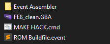

# Getting Started

_Note: Most tools are made for Windows operating systems. If you do not run windows I suggest running dual boot, or a virtual machine._

Things you will need:

[Event Assembler](https://feuniverse.us/t/event-assembler/1749) \(Aka EA\)  
A Clean FE8 ROM \(I can't link this for legal reasons, but it should be ~16MB\)  
A Hex Editor \(I recommend [HxD](https://mh-nexus.de/en/hxd/)\)

Things you will want:

A good text editor \(I use Sublime 3; Notepad++ or similar are also good\)  
[FEBuilderGBA](https://feuniverse.us/t/fe-builder-gba-if-you-have-any-questions-attach-report7z/2845) \(good for visualizing changes, finding things in ROM, etc - we won't be using it as our editor, though!\)

## Creating your Root folder

Start by creating a new folder with your project name. Make sure it is **free of special characters**. This folder is the **root** folder of your Buildfile. Inside the root, you will want to place the EA folder and your clean ROM. Then, create a new file named _"MAKE HACK.cmd"._ This will be our **compiler**. Whenever we make changes to the ROM, we will run this to apply them. But first, we need to actually make it apply said changes using EA. Open MAKE HACK in your text editor, and copy the following to it:

```text
cd %~dp0

copy FE8_clean.gba FE8_hack.gba

cd "%~dp0Event Assembler"

Core A FE8 "-output:%~dp0FE8_hack.gba" "-input:%~dp0ROM Buildfile.event"

pause
```

So what exactly is this block of code doing? Well, let's take it line by line.  
**cd %~dp0:** Change our directory to the current \(root\) folder.  
**copy FE8\_clean.gba FE8\_hack.gba**: Copy our clean ROM to a new ROM titled _"FE8\_hack.gba"._  
**cd "%~dp0Event Assembler"**: Change our directory to the EA folder.  
**Core A FE8 "-output:%~dp0FE8\_hack.gba" "-input:%~dp0ROM Buildfile.event"**: Run EA using the file _"ROM Buildfile.event"_ on the file _"FE8\_hack.gba"_.  
**pause**: Stop the cmd window from closing immediately.

In short, we copy over our fresh ROM, and then use EA to make changes to it.  
But, well, what changes? As you can see from the above, the changes to be made are written in the file _"ROM Buildfile.event"_. This is going to be our master controller for our buildfile. So, let's go ahead and create a new file and name it _**"**ROM Buildfile.event"._ For now, let's make a simple change. In the file, write **BYTE 0x0** and save.

At this point, our root folder should look something like this:



Now, let's go ahead and run MAKE HACK. And, viola, you should now have your altered ROM, FE8\_hack.gba! So, what was even changed? Well, let's run the ROM and find out! And, it doesn't actually do anything. In fact, **the game doesn't even start.** Well, that's because what we just did was break the ROM header! Whoops!

## Using your Hex Editor

Let's take a look at what we changed exactly. How do we do that? Well, we break out a hex editor of course! Open your clean ROM in your hex editor and make note of the very first value there - **0x2E**. Fascinating. Now, lets look at FE8\_hack.gba. As you might have guessed by now, it's in fact not **0x2E**, but rather **0x0**. So, I guess that's what that **BYTE 0x0** nonsense was about. Maybe I feel like actually playing Sacred Stones today, so let's make the ROM actually work this time. Here's where I ask you, the reader, to stop and make a guess about what you need to do to achieve that.  
...  
If your guess was to change **BYTE 0x0** to **BYTE 0x2E** in ROM Buildfile.event, you'd be absolutely right! Let's do that. Now we open our ROM, and... nothing. Weird. That's because editing the files doesn't actually do anything - at least, not until we recompile! Let's run MAKE HACK and then try again. There we go. 


This is important to remember; **always** recompile before testing your changes!


So, let's try something else. We can change more than one value, right? How about two bytes instead of one? Maybe **BYTE 0xFF 0xFF**? Let's give it a go! Edit ROM Buildfile, run MAKE HACK, and put FE8\_hack back in the hex editor, and there we are! Two lovely **FF**s. So, we write data sequentially - that is, in order. But what if I need to change a byte in the middle of the ROM? Surely I won't have to write out half of the ROM first to get there. And you'd be right in thinking so!

## ROM Offsets and the Current Offset

Somewhat obviously, everything in the ROM needs to be somewhere in the ROM; **everything has a location**. Much like buildings with addresses in a city, we can use ROM addresses to locate things in our ROM. When we were writing **BYTE 0x0** earlier, we did so at the very beginning of the ROM - offset **0x0**. But, when we wrote **BYTE 0xFF 0xFF**, we moved forwards while writing; while the first byte was at offset **0x0**, the second was at offset **0x1**. You can think of it like your cursor while typing - as we write, the cursor moves forward so we can print out the next character. Similarly, **as we write data into our ROM, the current offset advances** so we can keep writing more data. As stated earlier, it would certainly be a drag if this were the only way to change our current offset. We'd need to rewrite the whole ROM up to a certain point to get there! Luckily, we can manually change the current offset to whatever we like using **ORG**. Let's give it a whirl! In ROM Buildfile.event:

```text
ORG 0x1000
BYTE 0xFF 0xFF
```

Now, compile, and open it in the hex editor. Hm, nothing at the start of the ROM. Let's head on over to offset **0x1000**. For most hex editors, you can use **Ctrl+G** to goto a specific address. Don't forget to specify that this is **0x1000** in hex, and not decimal! And, there we are! At that offset will be our data. Pretty slick. With just **ORG** and **BYTE** in our ROM Buildfile.event file, we can theoretically make any changes we want! Of course, that sounds _horribly_ impractical, so next we'll take a look at just what kinds of commands EA is capable of.

